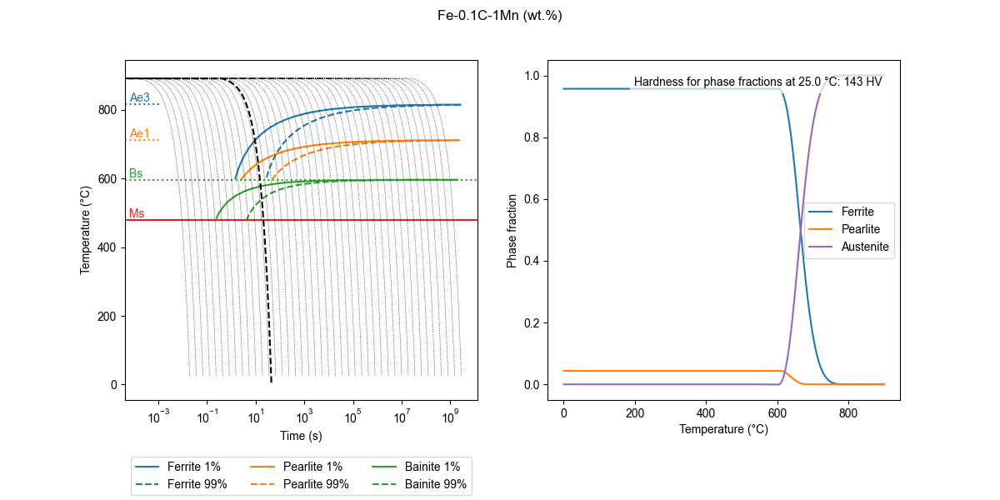

# About

Collection of scripts for calculating TTT and CCT diagrams of iron-based alloys using the methods described on the paper by [Li et al., 1998](https://github.com/arthursn/transformation-diagrams/blob/master/literature/Li%20et%20al%2C%201998%20(MetTransB)%20%5BA%20Computational%20Model%20for%20the%20Prediction%20of%20Steel%20Hardenability%5D.pdf).

Feel free to edit the code to, for instance, automatize the generation of diagrams. [`transformation_models.py`](https://github.com/arthursn/transformation-diagrams/blob/master/transformation_models.py) contains the models used for calculating the transformation diagrams. Two main classes are defined: `Alloy` and `TransformationDiagrams`. `Alloy` stores the information of the prior austenite grain size and composition, while `TransformationDiagrams` is used for plotting the TTT and CCT diagrams and phase fraction evolution for a given thermal cycle.

The repository also contains scripts for easy plotting of phase diagrams and phase fraction curves: [`plot_diagrams.py`](https://github.com/arthursn/transformation-diagrams/blob/master/plot_diagrams.py) and [`plot_phase_fractions.py`](https://github.com/arthursn/transformation-diagrams/blob/master/plot_phase_fractions.py).

# Dependencies

The python script works for python 2 (>= 2.7) and python 3 (>= 3.5). However, since support for python 2 has reached its end of life in January 2020, it is recommended to run the scripts using python 3.

The python script runs using the non standard python libraries `argparse`, `numpy`, `matplotlib`, `pandas`, and `scipy`. Install them from the [Python Package Index](https://pypi.org/):

```bash
pip3 install numpy matplotlib pandas argparse scipy --user
```

# Usage

[`plot_diagrams.py`](https://github.com/arthursn/transformation-diagrams/blob/master/plot_diagrams.py):

```bash
usage: plot_diagrams.py [-h] [-g GS] [-C C] [-Si SI] [-Mn MN] [-Ni NI] [-Mo MO] 
[-Cr CR] [-V V] [-Co CO] [-Cu CU] [-Al AL] [-W W] [-Tini TINI]

Script for plotting TTT and CCT diagrams

optional arguments:
  -h, --help            show this help message and exit
  -g GS, --gs GS        Grain size
  -C C, --C C           Carbon wt.%
  -Si SI, --Si SI       Silicon wt.%
  -Mn MN, --Mn MN       Manganese wt.%
  -Ni NI, --Ni NI       Nickel wt.%
  -Mo MO, --Mo MO       Molybdenum wt.%
  -Cr CR, --Cr CR       Chromium wt.%
  -V V, --V V           Vanadium wt.%
  -Co CO, --Co CO       Cobalt wt.%
  -Cu CU, --Cu CU       Copper wt.%
  -Al AL, --Al AL       Aluminium wt.%
  -W W, --W W           Tungsten wt.%
  -Tini TINI, --Tini TINI
                        Initial continuous cooling temperature

```

[`plot_phase_fractions.py`](https://github.com/arthursn/transformation-diagrams/blob/master/plot_phase_fractions.py):

```bash
usage: plot_phase_fractions.py [-h] -Tini TINI -t T [-phi PHI] [-g GS] [-C C] [-Si SI] 
[-Mn MN] [-Ni NI] [-Mo MO] [-Cr CR] [-V V] [-Co CO] [-Cu CU] [-Al AL] [-W W]

Script for plotting phase fraction curves for a given thermal cycle

optional arguments:
  -h, --help            show this help message and exit
  -Tini TINI, --Tini TINI
                        Initial temperature
  -t T, --t T           Total time
  -phi PHI, --phi PHI   Cooling rate (if 0, isothermal)
  -g GS, --gs GS        Grain size
  -C C, --C C           Carbon wt.%
  -Si SI, --Si SI       Silicon wt.%
  -Mn MN, --Mn MN       Manganese wt.%
  -Ni NI, --Ni NI       Nickel wt.%
  -Mo MO, --Mo MO       Molybdenum wt.%
  -Cr CR, --Cr CR       Chromium wt.%
  -V V, --V V           Vanadium wt.%
  -Co CO, --Co CO       Cobalt wt.%
  -Cu CU, --Cu CU       Copper wt.%
  -Al AL, --Al AL       Aluminium wt.%
  -W W, --W W           Tungsten wt.%
```

# Examples

A script with examples is available in the repository: [`examples.py`](https://github.com/arthursn/transformation-diagrams/blob/master/examples.py).

Plot TTT and CCT diagrams:

```bash
python3 mucg83_python_interface.py -C 0.1 -Mn 1
```

This will prompt a matplotlib window with the following TTT diagram:


Plot phase fraction for a thermal cycle specified by `-Tini`, `-t`, and `-phi` parameters:

```bash
python3 plot_phase_fractions.py -C 0.1 -Mn 1 -Tini 1000 -t 50 -phi 20
```


