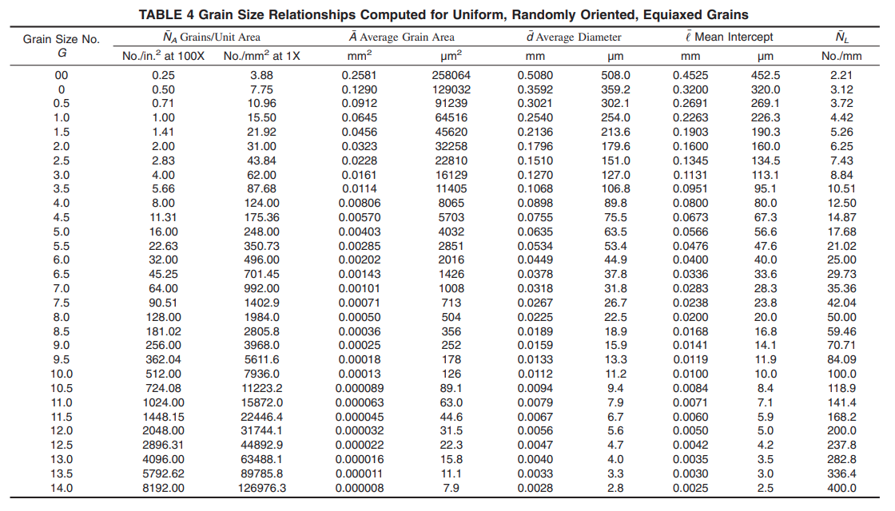
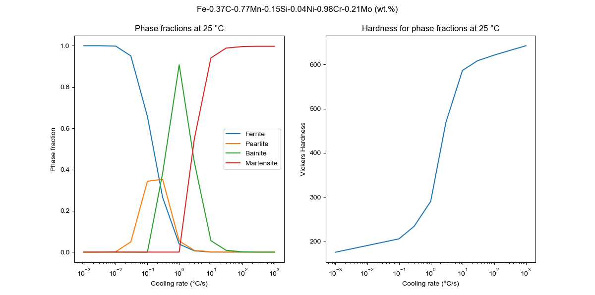

# About

Collection of scripts for calculating TTT and CCT diagrams of iron-based alloys using the methods described on the paper by [Li et al., 1998](https://github.com/arthursn/transformation-diagrams/blob/master/literature/Li%20et%20al%2C%201998%20(MetTransB)%20%5BA%20Computational%20Model%20for%20the%20Prediction%20of%20Steel%20Hardenability%5D.pdf).

Feel free to edit the code to, for instance, automatize the generation of diagrams. [`transformation_models.py`](https://github.com/arthursn/transformation-diagrams/blob/master/transformation_models.py) contains the models used for calculating the transformation diagrams. Two main classes are defined: `Alloy` and `TransformationDiagrams`. `Alloy` stores the information of the prior austenite grain size and composition, while `TransformationDiagrams` is used for plotting the TTT and CCT diagrams and phase fraction evolution for a given thermal cycle.

The repository also contains scripts for easy plotting of phase diagrams and phase fraction curves: [`plot_diagrams.py`](https://github.com/arthursn/transformation-diagrams/blob/master/plot_diagrams.py) and [`plot_phase_fractions.py`](https://github.com/arthursn/transformation-diagrams/blob/master/plot_phase_fractions.py).

The hardness of the heat treated material is estimated using Maynier et al., 1978 and implemented by Li et al., 1998. When `plot_phase_fractions.py` is called, the hardness of the final microstructure is displayed on the plot.

> **DISCLAIMER**: Calculation of phase fractions doesn't take into account how a phase transformation affect the austenite composition and therefore might affect the subsequent phase transformations. Use this model at your own risk.

# Dependencies

The scripts run in python 2 (>= 2.7) and python 3 (>= 3.5). However, since support for python 2 has reached its end of life in January 2020, it is recommended to run the scripts using python 3. It uses the non standard python libraries `argparse`, `numpy`, `matplotlib`, `pandas`, and `scipy`. In most modern python distributions these requirements should be already met in the native instalation, for example [Anaconda](https://www.anaconda.com/products/individual). Otherwise, you can install dependencies from the [Python Package Index](https://pypi.org/) using the [`pip`](https://pip.pypa.io/en/stable/installing/) command.

```bash
pip3 install numpy matplotlib pandas argparse scipy --user
```

# Usage

[`plot_diagrams.py`](https://github.com/arthursn/transformation-diagrams/blob/master/plot_diagrams.py):

```
usage: plot_diagrams.py [-h] [-g GS] [-C C] [-Si SI] [-Mn MN] [-Ni NI]
                        [-Mo MO] [-Cr CR] [-V V] [-Co CO] [-Cu CU] [-Al AL]
                        [-W W] [-Tini TINI]

Script for plotting TTT and CCT diagrams

optional arguments:
  -h, --help            show this help message and exit
  -g GS, --gs GS        ASTM grain size number (default: 7)
  -C C, --C C           Carbon wt.% (default: 0.0)
  -Si SI, --Si SI       Silicon wt.% (default: 0.0)
  -Mn MN, --Mn MN       Manganese wt.% (default: 0.0)
  -Ni NI, --Ni NI       Nickel wt.% (default: 0.0)
  -Mo MO, --Mo MO       Molybdenum wt.% (default: 0.0)
  -Cr CR, --Cr CR       Chromium wt.% (default: 0.0)
  -V V, --V V           Vanadium wt.% (default: 0.0)
  -Co CO, --Co CO       Cobalt wt.% (default: 0.0)
  -Cu CU, --Cu CU       Copper wt.% (default: 0.0)
  -Al AL, --Al AL       Aluminium wt.% (default: 0.0)
  -W W, --W W           Tungsten wt.% (default: 0.0)
  -Tini TINI, --Tini TINI
                        Initial continuous cooling temperature (oC) (default:
                        900.0)
```

[`plot_phase_fractions.py`](https://github.com/arthursn/transformation-diagrams/blob/master/plot_phase_fractions.py):

```
usage: plot_phase_fractions.py [-h] -Tini TINI -t T [-phi PHI] [-g GS] [-C C]
                               [-Si SI] [-Mn MN] [-Ni NI] [-Mo MO] [-Cr CR]
                               [-V V] [-Co CO] [-Cu CU] [-Al AL] [-W W]

Script for plotting phase fraction curves for a given thermal cycle

optional arguments:
  -h, --help            show this help message and exit
  -g GS, --gs GS        ASTM grain size number (default: 7)
  -C C, --C C           Carbon wt.% (default: 0.0)
  -Si SI, --Si SI       Silicon wt.% (default: 0.0)
  -Mn MN, --Mn MN       Manganese wt.% (default: 0.0)
  -Ni NI, --Ni NI       Nickel wt.% (default: 0.0)
  -Mo MO, --Mo MO       Molybdenum wt.% (default: 0.0)
  -Cr CR, --Cr CR       Chromium wt.% (default: 0.0)
  -V V, --V V           Vanadium wt.% (default: 0.0)
  -Co CO, --Co CO       Cobalt wt.% (default: 0.0)
  -Cu CU, --Cu CU       Copper wt.% (default: 0.0)
  -Al AL, --Al AL       Aluminium wt.% (default: 0.0)
  -W W, --W W           Tungsten wt.% (default: 0.0)

required arguments:
  -Tini TINI, --Tini TINI
                        Initial temperature (oC) (default: None)
  -t T, --t T           Total time (s) (default: None)
  -phi PHI, --phi PHI   Cooling rate (oC/s; if 0, isothermal) (default: 0.0)
```

Please notice that the grain size specified as the ASTM grain size number, defined by the [ASTM E112 standard](https://www.astm.org/Standards/E112.htm). The default value used in the scripts is 7, which corresponds to an average diameter of about 30 μm. Use the table below as a reference:



# Examples

A script with examples is available in the repository: [`examples.py`](https://github.com/arthursn/transformation-diagrams/blob/master/examples.py).

Plot TTT and CCT diagrams:

```bash
# Run directly from the shell
python3 plot_diagrams.py -C 0.1 -Mn 1 -Tini 900
```

```python
# Run using jupyter or ipython (e.g., if you're running Spyder)
%run plot_diagrams.py -C 0.1 -Mn 1 -Tini 900
```

This will prompt a matplotlib window with the following TTT and CCT diagrams:


Plot phase fraction for a thermal cycle specified by `-Tini`, `-t`, and `-phi` parameters:

```bash
# Run directly from the shell
python3 plot_phase_fractions.py -C 0.1 -Mn 1 -Tini 900 -t 45 -phi 20
```

```python
# Run using jupyter or ipython (e.g., if you're running Spyder)
%run plot_phase_fractions.py -C 0.1 -Mn 1 -Tini 900 -t 40 -phi 20
```


Custom scripts can also be written. For example, [`hardness_vs_cooling_rate.py`](https://github.com/arthursn/transformation-diagrams/blob/master/hardness_vs_cooling_rate.py) calculates the phase fractions and hardness values for a list of cooling rates and plots the phase fractions and hardness as a function of the cooling rate.

```bash
# Run directly from the shell
python3 hardness_vs_cooling_rate.py
```

```python
# Run using jupyter or ipython (e.g., if you're running Spyder)
%run hardness_vs_cooling_rate.py
```



The hardness is given in Vickers. A hardness conversion tool for other units (e.g., Rockewell, Brinell) can be found here: [Hardness conversion tool](https://arthursn.github.io/hardness.html)
